# Authentication Flow Diagram - VibeRide

This diagram illustrates the complete authentication lifecycle for VibeRide, including user registration, login, session management, and sign-out flows.

## Authentication Sequence Diagram

```mermaid
sequenceDiagram
    autonumber
    
    participant Browser
    participant Middleware
    participant AstroAPI as Astro API
    participant SupabaseAuth as Supabase Auth
    participant GoogleOAuth as Google OAuth
    
    Note over Browser,GoogleOAuth: First-Time User Registration Flow
    
    Browser->>Middleware: GET /
    Middleware->>SupabaseAuth: Check session
    SupabaseAuth-->>Middleware: No session
    Middleware-->>Browser: Render landing page
    
    Browser->>SupabaseAuth: Click Sign in with Google
    Note over Browser,SupabaseAuth: PKCE: Generate code_verifier,<br/>store in session storage
    SupabaseAuth->>GoogleOAuth: Redirect with code_challenge
    GoogleOAuth-->>Browser: Show consent screen
    
    Browser->>GoogleOAuth: User grants permissions
    GoogleOAuth->>Browser: Redirect to /auth/callback?code=xyz
    
    Browser->>AstroAPI: GET /auth/callback?code=xyz
    AstroAPI->>SupabaseAuth: exchangeCodeForSession(code)
    Note over AstroAPI,SupabaseAuth: PKCE: Validate code_verifier<br/>matches code_challenge
    
    alt PKCE validation successful
        SupabaseAuth-->>AstroAPI: Session tokens
        AstroAPI->>SupabaseAuth: Check user_preferences
        
        alt New user (no preferences)
            SupabaseAuth-->>AstroAPI: No preferences found
            AstroAPI-->>Browser: Redirect to /profile
            Note over Browser: User completes profile form
            Browser->>AstroAPI: POST /api/user/preferences
            AstroAPI->>SupabaseAuth: Insert user_preferences
            SupabaseAuth-->>AstroAPI: Success
            AstroAPI-->>Browser: Redirect to /notes
        else Existing user
            SupabaseAuth-->>AstroAPI: Preferences exist
            AstroAPI-->>Browser: Redirect to /notes
        end
    else PKCE validation failed
        SupabaseAuth-->>AstroAPI: Error: auth_failed
        AstroAPI-->>Browser: Redirect to /?error=auth_failed
        Browser->>Browser: Display error banner
    end
    
    Note over Browser,SupabaseAuth: Authenticated Session Flow
    
    Browser->>Middleware: GET /notes
    Middleware->>SupabaseAuth: getSession()
    
    alt Valid session
        SupabaseAuth-->>Middleware: Session data
        Middleware->>Middleware: Set locals.user
        Middleware-->>Browser: Render /notes page
    else Session expired
        SupabaseAuth-->>Middleware: No session
        Middleware->>Middleware: Set locals.user = null
        Middleware-->>Browser: Redirect to /?returnTo=/notes
    end
    
    Note over Browser,SupabaseAuth: Session Refresh Flow
    
    Browser->>AstroAPI: POST /api/notes
    Note over Browser,SupabaseAuth: Access token has <10% lifetime
    Browser->>SupabaseAuth: Auto refresh token
    SupabaseAuth->>SupabaseAuth: Validate refresh token
    
    alt Refresh successful
        SupabaseAuth-->>Browser: New access token
        Browser->>AstroAPI: Retry POST /api/notes
        AstroAPI-->>Browser: Success response
    else Refresh failed
        SupabaseAuth-->>Browser: Error: invalid token
        Browser->>Browser: Show session expired toast
        Browser->>Browser: Redirect to / after 3s
    end
    
    Note over Browser,SupabaseAuth: API Request with Expired Session
    
    Browser->>AstroAPI: POST /api/notes/:id/itineraries
    AstroAPI->>Middleware: Validate user
    
    alt No valid session
        Middleware-->>AstroAPI: locals.user = null
        AstroAPI-->>Browser: 401 Unauthorized
        Browser->>Browser: Toast: Session expired
        Browser->>Browser: Redirect to / after 3s
    else Valid session
        Middleware-->>AstroAPI: locals.user = {id, email}
        AstroAPI->>SupabaseAuth: Verify note ownership
        
        alt User owns note
            SupabaseAuth-->>AstroAPI: Ownership confirmed
            AstroAPI->>AstroAPI: Process generation
            AstroAPI-->>Browser: 202 Accepted
        else User does not own note
            SupabaseAuth-->>AstroAPI: Ownership denied
            AstroAPI-->>Browser: 403 Forbidden
        end
    end
    
    Note over Browser,SupabaseAuth: Sign-Out Flow
    
    Browser->>Browser: Click Sign Out button
    Browser->>Browser: Show confirmation dialog
    Browser->>Browser: User confirms sign out
    
    Browser->>AstroAPI: POST /api/auth/signout
    AstroAPI->>SupabaseAuth: signOut()
    SupabaseAuth->>SupabaseAuth: Invalidate session
    
    alt Sign-out successful
        SupabaseAuth-->>AstroAPI: Success
        AstroAPI->>AstroAPI: Delete cookies
        AstroAPI-->>Browser: 200 OK
        Browser->>Browser: Toast: Signed out
        Browser->>Browser: Redirect to /
    else Sign-out failed
        SupabaseAuth-->>AstroAPI: Error
        AstroAPI-->>Browser: 500 Internal Server Error
        Browser->>Browser: Toast: Sign out failed, retry
    end
    
    Note over Browser,SupabaseAuth: Protected Route Access
    
    Browser->>Middleware: GET /profile (unauthenticated)
    Middleware->>SupabaseAuth: getSession()
    SupabaseAuth-->>Middleware: No session
    Middleware->>Middleware: Capture returnTo=/profile
    Middleware-->>Browser: Redirect to /?returnTo=/profile
    
    Browser->>Browser: User signs in via Google
    Browser->>AstroAPI: OAuth callback with returnTo
    AstroAPI->>SupabaseAuth: exchangeCodeForSession()
    SupabaseAuth-->>AstroAPI: Session created
    AstroAPI->>AstroAPI: Check returnTo parameter
    
    alt Has returnTo and preferences exist
        AstroAPI-->>Browser: Redirect to /profile
    else Has returnTo but no preferences
        AstroAPI-->>Browser: Redirect to /profile (complete first)
    else No returnTo
        AstroAPI-->>Browser: Redirect to /notes (default)
    end
```

<mermaid_diagram>




</mermaid_diagram>

```
## Flow Descriptions

### 1. First-Time User Registration
- User visits landing page and clicks "Sign in with Google"
- PKCE code_verifier generated and stored in session storage
- Google OAuth consent screen appears
- After consent, callback receives authorization code
- Supabase validates PKCE and exchanges code for session tokens
- System checks if user preferences exist
- New users redirected to profile completion
- After profile saved, redirected to notes page

### 2. Returning User Login
- Similar to registration but skips profile completion
- Existing users with complete preferences go directly to notes page

### 3. Session Validation (Middleware)
- Every request passes through middleware
- Middleware calls `getSession()` to validate current session
- Valid sessions populate `Astro.locals.user`
- Invalid/expired sessions result in redirect to landing page
- Protected routes preserve original URL in `returnTo` parameter

### 4. Automatic Session Refresh
- Supabase client monitors access token lifetime
- When <10% lifetime remains, automatic refresh triggered
- Refresh token exchanged for new access token
- Failed refresh results in session expiration flow

### 5. API Authentication
- All API endpoints validate `locals.user` from middleware
- Missing user returns 401 Unauthorized
- Client-side HTTP utility intercepts 401 responses
- User sees "session expired" toast and redirects to landing

### 6. Note Ownership Validation
- Generation endpoints verify user owns the note
- Ownership check via database query
- Non-owners receive 403 Forbidden response

### 7. Sign-Out Flow
- User clicks sign-out from profile or tab bar
- Confirmation dialog prevents accidental sign-outs
- API endpoint calls Supabase `signOut()`
- Session invalidated and cookies cleared
- User redirected to landing page

### 8. Protected Route with Return URL
- Unauthenticated access to protected routes captured
- Original URL encoded in `returnTo` parameter
- After successful authentication, user redirected to original destination
- New users must complete profile before accessing intended route

## Security Features

### PKCE Flow (Proof Key for Code Exchange)
- **Code Verifier**: Random string generated client-side, stored in session storage
- **Code Challenge**: SHA256 hash of code_verifier sent to authorization server
- **Validation**: During token exchange, server verifies hash matches original
- **Protection**: Prevents authorization code interception attacks
- **CSRF Prevention**: Eliminates need for state parameter

### Session Security
- **HTTP-only Cookies**: Tokens not accessible via JavaScript
- **Secure Flag**: HTTPS-only in production
- **SameSite=Lax**: CSRF protection
- **1-hour Access Token**: Limited exposure window
- **30-day Refresh Token**: Balance between security and UX

### Row-Level Security (RLS)
- All database tables enforce `user_id = auth.uid()` policies
- Users can only access their own data
- Enforced at database level, not just application level

## Error Handling

### OAuth Errors
- `auth_failed`: General authentication failure (includes PKCE validation)
- `invalid_code`: Authorization code invalid or expired
- `network_error`: Network connectivity issues
- `auth_cancelled`: User denied OAuth consent

### Session Errors
- `unauthorized`: No valid session (401)
- `session_expired`: Token expired and refresh failed
- `signout_failed`: Sign-out operation failed (500)

### Authorization Errors
- `forbidden`: User lacks permission for resource (403)
- `generation_in_progress`: Concurrent generation blocked (429)

## Development Mode (DEVENV)

When `DEVENV=true`:
- Authentication bypassed in middleware
- Default user injected: `{id: '00000000-0000-0000-0000-000000000001', email: 'dev@viberide.local'}`
- Allows local development without Google OAuth setup
- **Must be disabled in production**

---

**Diagram Version:** 1.0  
**Last Updated:** 2025-11-24  
**Related Documents:**
- `.ai/auth-spec.md` - Complete authentication specification
- `.ai/prd.md` - Product requirements
- `.ai/auth-spec-security-fix.md` - PKCE security documentation

